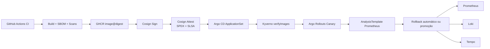

# Arquitetura

## Visão geral

O projeto implementa um laboratório Kubernetes local com governança GitOps e segurança de ponta a ponta, simulando um cenário multiambiente.

Topologia:

- `sgp-dev`: cluster hub (plataforma central).
- `sgp-homolog`: cluster spoke.
- `sgp-prod`: cluster spoke.

## Fluxo principal (supply chain + runtime)

## Componentes por domínio

- GitOps: Argo CD + ApplicationSet no hub.
- Progressive delivery: Argo Rollouts.
- Políticas: Kyverno (baseline + supply chain).
- Segredos: Vault (hub) + External Secrets nos 3 clusters.
- PKI: Step-CA (hub) + cert-manager + step-issuer nos 3 clusters.
- Segurança runtime: Trivy Operator obrigatório, Falco opcional em WSL.
- Observabilidade: Prometheus/Loki/Tempo/Grafana + OTel Collector.
  - `dev`: stack completa (Prometheus, Loki, Tempo, OTel).
  - `homolog` e `prod`: Prometheus + OTel para análise de rollout e SLO.

## Topologia de clusters e portas

- `sgp-dev`:
  - API: `:6550`
  - Ingress: `:8081` e `:8444`
  - Vault exposto para spokes: `:18200`
  - Step-CA exposto para spokes: `:19443`
- `sgp-homolog`:
  - API: `:6551`
  - Ingress: `:8082` e `:8445`
- `sgp-prod`:
  - API: `:6552`
  - Ingress: `:8083` e `:8446`

## GitOps e governança

Fonte de verdade:

- Bootstrap Argo: `gitops/bootstrap/`
- Aplicações por ambiente: `gitops/clusters/{dev,homolog,prod}/`

Modelo de projetos Argo CD:

- `platform-core`: operadores e componentes de plataforma (destinos `sgp-*-platform`).
- `workloads-dev`, `workloads-homolog`, `workloads-prod`: workloads por ambiente (destinos `sgp-*-workloads`).

Promoção:

- Fluxo por PR manual: `dev -> homolog -> prod`.

## Segurança e supply chain

Matriz de enforcement de policy:

- `dev`: auditoria para políticas de baseline e supply chain.
- `homolog`: enforcement para `verifyImages` e validação pré-produção.
- `prod`: enforcement total.

Pipeline de artefato:

- Build e publicação em GHCR (source of truth).
- SBOM + scan + assinatura + attestation.
- Verificação (`cosign verify` e `cosign verify-attestation`) com chave pública.
- Deploy por digest no workload de demonstração (`secure-gitops-demo-app`), sem substituir o `podinfo`.
- Sync opcional para registry local (`localhost:5001`).

## Segredos e PKI

- Bootstrap sensível cifrado em `.secrets/` com `SOPS + age`.
- Vault no hub fornece segredos para ESO nos três clusters.
- Step-CA no hub assina via step-issuer; endpoint padrão consumido pelos clusters: `https://host.k3d.internal:19443`.

## Observabilidade e SLO

- Objetivo padrão: disponibilidade `99.5%` para `podinfo`.
- SLI de disponibilidade e latência em `slo/objectives.yaml`.
- Alertas de burn-rate e latência em `slo/alert-rules.yaml`.
- Runbooks de resposta em `runbooks/`.

## Limitações conhecidas de laboratório

- WSL pode limitar o comportamento de Falco.
- Em ambiente local, alguns operadores podem apresentar diferenças transitórias de sincronização no Argo CD sem impactar o aceite final; o gate de aceite é `make verify`.
